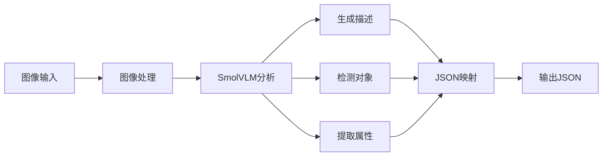

# Vision JSON Mapping

这个模块提供了基于视觉AI的JSON映射功能，使用SmolVLM模型进行图像分析和描述生成。

## 特性

- 图像分析和描述生成
- 对象检测
- 图像属性提取（尺寸、格式、颜色等）
- 灵活的JSON映射规则
- 支持自定义转换和条件

## 安装

```bash
pnpm install
```

## 快速开始

```typescript
import { VisionProcessor } from './vision/smolvlm';
import { readFileSync } from 'fs';

async function main() {
  // 创建VisionProcessor实例
  const processor = new VisionProcessor({
    modelPath: 'models/smolvlm-v1',
    deviceType: 'cpu',
    maxTokens: 512
  });

  // 初始化
  await processor.initialize();

  // 读取图像
  const imageData = readFileSync('path/to/image.jpg');

  // 分析图像
  const analysis = await processor.analyzeImage(imageData);

  // 生成JSON映射
  const jsonMapping = await processor.generateJsonMapping(analysis);

  console.log(jsonMapping);
}

main().catch(console.error);
```

## 自定义映射规则

你可以通过提供自定义规则来控制JSON映射的行为：

```typescript
const customRules = [
  {
    source: 'description',
    target: 'content.description',
    transform: [
      {
        type: 'custom',
        customFunction: (value: string) => value.toUpperCase()
      }
    ]
  },
  {
    source: 'objects',
    target: 'content.items',
    condition: {
      type: 'custom',
      customFunction: (value: string[]) => value.length > 0
    }
  }
];

const jsonMapping = await processor.generateJsonMapping(analysis, undefined, customRules);
```

## 架构

### 核心组件

1. **VisionProcessor**
   - 主要接口类
   - 处理图像分析和JSON映射
   - 集成其他组件

2. **SmolVLM**
   - 视觉AI模型封装
   - 处理图像嵌入生成
   - 生成图像描述
   - 检测对象

3. **MappingProcessor**
   - 处理JSON映射逻辑
   - 支持复杂的转换规则
   - 提供Schema验证

4. **ImageProcessor**
   - 图像预处理
   - 属性提取
   - 格式验证

5. **Tokenizer**
   - 文本tokenization
   - 支持特殊token
   - 处理序列长度

### 数据流



## API参考

### VisionProcessor

```typescript
class VisionProcessor {
  constructor(config: VisionConfig);
  async initialize(): Promise<void>;
  async analyzeImage(imageData: Buffer): Promise<ImageAnalysisResult>;
  async generateJsonMapping(
    imageAnalysis: ImageAnalysisResult,
    schema?: SchemaDefinition,
    customRules?: MappingRule[]
  ): Promise<Record<string, any>>;
}
```

### MappingRule

```typescript
interface MappingRule {
  source: string;
  target: string;
  transform?: TransformRule[];
  condition?: ConditionRule;
  default?: any;
}
```

### TransformRule

```typescript
interface TransformRule {
  type: 'format' | 'extract' | 'combine' | 'filter' | 'custom';
  params?: Record<string, any>;
  customFunction?: (value: any) => any;
}
```

### ConditionRule

```typescript
interface ConditionRule {
  type: 'exists' | 'equals' | 'contains' | 'regex' | 'custom';
  value?: any;
  customFunction?: (value: any) => boolean;
}
```

## 示例

### 基本用法

```typescript
import { VisionProcessor } from './vision/smolvlm';
import { readFileSync } from 'fs';

async function analyzeImage(imagePath: string) {
  const processor = new VisionProcessor();
  await processor.initialize();

  const imageData = readFileSync(imagePath);
  const analysis = await processor.analyzeImage(imageData);

  return await processor.generateJsonMapping(analysis);
}
```

### 带Schema验证

```typescript
import { SchemaDefinition } from './vision/types';

const schema: SchemaDefinition = {
  type: 'object',
  properties: {
    imageContent: {
      type: 'object',
      properties: {
        description: { type: 'string' },
        detectedObjects: {
          type: 'array',
          items: { type: 'string' }
        },
        attributes: {
          type: 'object',
          properties: {
            dimensions: {
              type: 'object',
              properties: {
                width: { type: 'number' },
                height: { type: 'number' }
              }
            },
            format: { type: 'string' },
            dominantColors: {
              type: 'array',
              items: { type: 'string' }
            }
          }
        }
      }
    }
  }
};

const jsonMapping = await processor.generateJsonMapping(analysis, schema);
```

### 自定义转换

```typescript
const customRules = [
  {
    source: 'description',
    target: 'content.summary',
    transform: [
      {
        type: 'custom',
        customFunction: (text: string) => {
          return text.split('.')[0] + '.'; // 只保留第一句
        }
      }
    ]
  },
  {
    source: 'objects',
    target: 'content.tags',
    transform: [
      {
        type: 'filter',
        params: {
          predicate: (item: string) => item.length > 3
        }
      },
      {
        type: 'custom',
        customFunction: (items: string[]) => {
          return items.map(item => `#${item}`);
        }
      }
    ]
  }
];

const jsonMapping = await processor.generateJsonMapping(analysis, undefined, customRules);
```

## 贡献

欢迎贡献代码和提出建议！请确保：

1. 遵循TypeScript代码规范
2. 添加适当的测试
3. 更新相关文档
4. 提交前运行测试套件

## 许可证

MIT License
